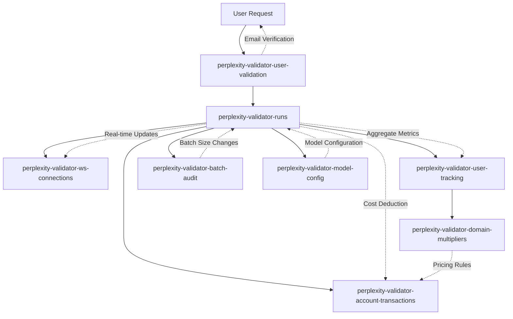

# DynamoDB Tables Documentation

This document describes the current DynamoDB table structure for the Perplexity Validator system.

## Table Overview

The system uses 10 DynamoDB tables to manage validation sessions, user data, financial transactions, real-time connections, batch size management, and model configurations:

### 📊 **Core Tables (Essential)**

| Table | Purpose | Items | Size | Status |
|-------|---------|-------|------|--------|
| `perplexity-validator-runs` | Modern session tracking & progress | 245 | 698KB | ✅ Active |
| `perplexity-validator-user-tracking` | User analytics & usage aggregation | 8 | 3.8KB | ✅ Active |
| `perplexity-validator-user-validation` | Email verification workflow | 4 | 993B | ✅ Active |
| `perplexity-validator-account-transactions` | Financial transaction history | 1 | 230B | ✅ Active |
| `perplexity-validator-domain-multipliers` | Domain-specific cost multipliers | 2 | ~300B | ✅ Active |
| `perplexity-validator-ws-connections` | WebSocket connection management | 0 | 0B | ✅ Active (ephemeral) |
| `perplexity-validator-batch-audit` | Dynamic batch size change audit log | 0 | 0B | ✅ Active |
| `perplexity-validator-model-config` | Model configuration management | 0 | 0B | ✅ Active |

### 🗑️ **Legacy Tables (Cleaned)**

| Table | Purpose | Items | Size | Status |
|-------|---------|-------|------|--------|
| `perplexity-validator-call-tracking` | Legacy session tracking | 0 | 0B | 🧹 Cleared |
| `perplexity-validator-token-usage` | Granular token usage tracking | 0 | 0B | 🧹 Empty/Unused |

## Detailed Table Schemas

### 1. `perplexity-validator-runs`

**Purpose:** Modern session tracking with real-time progress updates and rich validation data.

**Key Schema:**
- `session_id` (HASH) - Unique session identifier (format: `session_YYYYMMDD_HHMMSS_xxxxxxxx`)

**Key Fields:**
```json
{
  "session_id": "session_20250811_222303_bc5e4d25",
  "email": "user@domain.com",
  "status": "COMPLETED|IN_PROGRESS|FAILED",
  "run_type": "Preview|Validation|Config Generation|Config Refinement",  // NEW: Clear run type identification
  "start_time": "2025-08-11T22:23:27.561528+00:00",
  "end_time": "2025-08-11T22:23:30.746079+00:00",
  "percent_complete": 100.0,
  "processed_rows": 3.0,
  "total_rows": 114.0,
  "batch_size": 80,  // Now reported for all run types including previews
  
  // Account balance tracking at time of run
  "account_current_balance": 42.50,        // Balance after the run completion
  "account_sufficient_balance": "n/a",     // Whether balance was sufficient (set to n/a)
  "account_credits_needed": "n/a",         // Credits needed if insufficient (set to n/a)
  "account_domain_multiplier": 3.0,        // Domain multiplier applied to this run
  
  // Model usage tracking for transparency
  "models": "sonar-pro X 3, sonnet-4 X 1, opus-4-1 X 1, sonar-pro (high context) X 2",
  
  // Input data tracking
  "input_table_name": "my_data_table.xlsx",           // Original table filename
  "configuration_id": "config_v1_ai_generated",       // Configuration ID used for validation
  "results_s3_key": "enhanced_results/session_123/validation_results_enhanced.xlsx",  // Points to enhanced validation results directory
  
  // CONSOLIDATED: Cost and timing fields
  "eliyahu_cost": 0.17357700,              // NEW: Actual cost incurred for this run (replaces preview_cost)
  "quoted_validation_cost": 6.595926,      // NEW: What user will pay for full validation (replaces quoted_full_cost)
  "estimated_validation_eliyahu_cost": 5.125, // NEW: Raw eliyahu cost estimate without multiplier or rounding
  "time_per_row_seconds": 2.5,             // NEW: Time per row - estimated for preview, measured for validation (renamed from actual_time_per_row_seconds)
  "estimated_validation_time_minutes": 12.3,    // Total estimated validation time in minutes only
  "run_time_s": 135.8,                     // NEW: Actual run time in seconds for this specific run
  
  "preview_data": {
    "actual_batch_size": 80,
    "estimated_validation_batches": 2,
    "cost_estimates": {
      "per_row_cost": 0.057859              // Per-row cost with multiplier applied (what user pays per row)
    },
    "token_usage": {
      "total_tokens": 25695.0,              // REMOVED: per_row_tokens, estimated_total_tokens, preview_tokens
      "by_provider": {
        "perplexity": {
          "prompt_tokens": 17654.0,
          "completion_tokens": 8041.0,
          "total_cost": 0.17357700,
          "calls": 15.0
        },
        "anthropic": {
          "total_cost": 0.0,
          "calls": 0.0                      // REMOVED: cache token fields - using own caching
        }
      }
    },
    "validation_metrics": {
      "search_groups_count": 5.0,
      "validated_columns_count": 23.0
    }
  }
}
```

**Configuration Generation Example:**
```json
{
  "session_id": "session_20250811_145623_ai_config",
  "email": "user@domain.com",
  "status": "COMPLETED",
  "run_type": "Config Generation",     // NEW: Clear identification
  "start_time": "2025-08-11T14:56:23.456789+00:00",
  "end_time": "2025-08-11T14:57:45.123456+00:00",
  "percent_complete": 100.0,
  "processed_rows": 1.0,              // One config generated
  "total_rows": 0.0,                  // No validation rows processed
  "batch_size": 1,                    // Config generation batch size
  
  // Account balance tracking
  "account_current_balance": 0.0,      // Config generation is currently free
  "account_sufficient_balance": "n/a",
  "account_credits_needed": "n/a", 
  "account_domain_multiplier": 1.0,    // Config generation doesn't use domain multiplier
  
  // Model usage for config generation
  "models": "sonar-pro X 1, claude-3.5-sonnet X 2",
  
  // Configuration tracking
  "input_table_name": "sales_data.xlsx",
  "configuration_id": "config_v2_ai_generated_20250811",
  "results_s3_key": "unified/user@domain.com/session_20250811_145623/configs/config_v2.json",  // Points to generated config file
  
  // CONSOLIDATED: Cost and timing fields for config generation
  "eliyahu_cost": 0.0425,              // Actual AI cost for config generation
  "quoted_validation_cost": 0.0,       // Config generation is free to users
  "estimated_validation_eliyahu_cost": null, // Not applicable for config generation
  "time_per_row_seconds": null,       // Not applicable for config generation  
  "estimated_validation_time_minutes": null, // Not applicable for config generation
  "run_time_s": 82.67,                // Actual config generation time in seconds
  
  // Config generation does not have preview_data - metadata is tracked at top level
}
```

**Consolidated Cost Tracking:**
1. **`eliyahu_cost`**: What we actually paid for this specific run (includes caching savings) - **ACTUAL COST PER RUN**
2. **`quoted_validation_cost`**: What user will pay/was charged for full validation - **USER CHARGE AMOUNT**
   - For Preview: Estimated cost for full validation (what user would pay, with multiplier + rounding)
   - For Validation: Amount actually charged to user (should match eliyahu_cost with multiplier)
   - For Config Generation: 0 (free service)
3. **`estimated_validation_eliyahu_cost`**: Raw eliyahu cost estimate without multiplier or rounding - **RAW COST ESTIMATE**
   - For Preview: What full validation would cost us (no multiplier, no rounding, assumes no caching)
   - For Validation: The estimate from the last preview (not actual cost - that's eliyahu_cost)
   - For Config Generation: null (not applicable)

**Field Consolidation:**
- ❌ `preview_cost` → ✅ `eliyahu_cost` (unified actual cost field)
- ❌ `estimated_full_cost` → ✅ `quoted_validation_cost` (what user pays)
- ❌ `quoted_full_cost` → ✅ `quoted_validation_cost` (clearer name)
- ❌ `charged_cost` → ✅ `quoted_validation_cost` (same concept, clearer name)
- ➕ **NEW**: `estimated_validation_eliyahu_cost` (raw cost estimate without multiplier/rounding)

**Cost Scaling Logic:** Only `quoted_validation_cost` involves scaling, multiplier, rounding, and $2 minimum. 
- `estimated_validation_eliyahu_cost` = `(preview_estimated_cost ÷ preview_rows) × total_rows` (raw estimate, no caching)
- `quoted_validation_cost` = `max(2.0, ceil((preview_estimated_cost × multiplier ÷ preview_rows) × total_rows))` (with multiplier, rounding, $2 minimum)

**Business Logic:** Preview calculates and sends `quoted_validation_cost` via websocket. Full validation charges exactly that `quoted_validation_cost` from preview, ensuring users pay the promised amount regardless of actual full validation costs.

**Run Type Classification:**
- **`Preview`**: Fast validation of first few rows for cost estimation and result preview
- **`Validation`**: Full table validation with complete processing and results delivery  
- **`Config Generation`**: AI-powered configuration file generation from table analysis
- **`Config Refinement`**: User-guided refinement of existing configuration files

**Consolidated Timing Fields:**
- **`time_per_row_seconds`**: Timing per row (estimated for preview, measured for validation, null for config generation)
- **`estimated_validation_time_minutes`**: Total estimated validation time in minutes (null for config generation)
- **`run_time_s`**: Actual run time in seconds for this specific run (all run types)
- ❌ Removed: `preview_processing_time_seconds`, `actual_time_per_row_seconds`, `estimated_total_processing_time_seconds`

**Batch Size Tracking:** Enhanced dynamic batch sizing with per-model configuration, now reported for all run types.
- **`batch_size`**: Top-level field storing the actual batch size used for validation
- **`preview_data.actual_batch_size`**: Batch size determined by enhanced batch manager
- **`preview_data.estimated_validation_batches`**: Total batches calculated with actual batch size
- **Dynamic sizing**: Uses minimum batch size across models for multi-model validations
- **Pattern matching**: Configured via hierarchical model patterns (e.g., "claude-4*", "sonar-pro*")

### 2. `perplexity-validator-user-tracking`

**Purpose:** Aggregate user analytics, lifetime usage statistics, and account balance.

**Key Schema:**
- `email` (HASH) - User email address

**Global Secondary Indexes:**
- `EmailDomainIndex`: `email_domain` (HASH) + `last_access` (RANGE)

**Key Fields:**
```json
{
  "email": "user@domain.com",
  "email_domain": "domain.com",
  "created_at": "2025-07-02T07:52:05.380000+00:00",
  "last_access": "2025-08-11T22:23:30.746079+00:00",
  
  // Request counts by type (explicit tracking)
  "total_previews": 15,
  "total_validations": 8,
  "total_configurations": 3,
  
  // NEW: Enhanced validation metrics
  "total_rows_processed": 1250.0,
  "total_rows_analyzed": 5000.0,
  "total_columns_validated": 180.0,
  "total_search_groups": 45.0,
  "total_high_context_search_groups": 12.0,
  "total_claude_calls": 8.0,
  
  // Cost tracking with consolidated nomenclature
  "total_eliyahu_cost": 28.50,        // What we paid (actual costs across all runs)
  "total_quoted_validation_cost": 137.25,   // What we quoted users for all validations
  "total_validation_revenue": 98.50,        // What we collected from users for validations
  "total_config_eliyahu_cost": 5.25,          // Config generation costs (eliyahu expense)
  
  // Request-type specific metrics  
  "preview_rows_processed": 450.0,
  "preview_eliyahu_cost": 12.25,
  "validation_rows_processed": 800.0,
  "validation_revenue": 98.50,
  "config_generation_eliyahu_cost": 5.25,
  
  // NEW: API call tracking
  "total_api_calls_made": 125,         // Total number of API calls made across all runs
  "total_cached_calls_made": 45,       // Total number of cached API calls across all runs
  
  "account_balance": 51.0,
  "balance_last_updated": "2025-08-13T13:59:43.475937+00:00"
}
```

**Note:** Totals are aggregated across all user sessions, not per-session.

### 3. `perplexity-validator-user-validation`

**Purpose:** Email verification and authentication workflow.

**Key Schema:**
- `email` (HASH) - User email address

**Global Secondary Indexes:**
- `ValidationCodeIndex`: `validation_code` (HASH)

**Key Fields:**
```json
{
  "email": "user@domain.com",
  "validation_code": "ABC123",
  "created_at": "2025-08-09T20:16:29.156889+00:00",
  "expires_at": "2025-08-09T21:16:29.156889+00:00",
  "validated": true,
  "validated_at": "2025-08-09T20:17:17.514750+00:00",
  "attempts": 1,
  "ttl": 1728000000
}
```

**TTL:** Enabled on `ttl` field for automatic cleanup of expired codes.

### 4. `perplexity-validator-account-transactions`

**Purpose:** Financial audit trail for credit purchases, deductions, and balance changes.

**Key Schema:**
- `email` (HASH) - User email address
- `transaction_id` (RANGE) - Unique transaction UUID

**Global Secondary Indexes:**
- `SessionIndex`: Links transactions to validation sessions
- `TimestampIndex`: Time-based queries

**Key Fields:**
```json
{
  "email": "user@domain.com",
  "transaction_id": "2bd1156e-e3bd-41c3-9d8d-f33b965af92a",
  "timestamp": "2025-08-13T13:59:43.475937+00:00",
  "transaction_type": "admin_credit|session_deduction|purchase",
  "amount": 25.50,
  "balance_before": 25.50,
  "balance_after": 51.0,
  "description": "Manual credit added by admin via CLI",
  "session_id": "session_20250811_222303_bc5e4d25"
}
```

### 5. `perplexity-validator-domain-multipliers`

**Purpose:** Domain-specific cost multipliers for differential pricing.

**Key Schema:**
- `domain` (HASH) - Domain name or "global" for default

**Key Fields:**
```json
{
  "domain": "eliyahu.ai",
  "multiplier": 3.0,
  "created_at": "2025-08-13T14:00:57.570963+00:00",
  "created_by": "admin@cli",
  "notes": "Set via CLI on 2025-08-13T08:00:57.562505",
  "updated_at": "2025-08-13T14:00:57.570963+00:00"
}
```

**Special Domains:**
- `global`: Default multiplier (5.0x)
- `eliyahu.ai`: Custom multiplier (3.0x)

### 6. `perplexity-validator-ws-connections`

**Purpose:** WebSocket connection management for real-time progress updates.

**Key Schema:**
- `connection_id` (HASH) - WebSocket connection ID

**Key Fields:**
```json
{
  "connection_id": "abc123def456",
  "email": "user@domain.com",
  "session_id": "session_20250811_222303_bc5e4d25",
  "connected_at": "2025-08-11T22:23:27.561528+00:00",
  "ttl": 1728000000
}
```

**Note:** Connections are ephemeral and auto-expire via TTL.

### 7. `perplexity-validator-batch-audit`

**Purpose:** Audit trail for dynamic batch size changes with comprehensive context tracking.

**Key Schema:**
- `audit_id` (HASH) - Unique audit entry UUID

**Global Secondary Indexes:**
- `ModelIndex`: `model` (HASH) + `timestamp` (RANGE) - Query changes by model
- `SessionIndex`: `session_id` (HASH) + `timestamp` (RANGE) - Query changes by session

**Key Fields:**
```json
{
  "audit_id": "550e8400-e29b-41d4-a716-446655440000",
  "timestamp": "2025-08-22T10:30:45.123456+00:00",
  "model": "claude-4-opus",
  "old_batch_size": 100,
  "new_batch_size": 110,
  "change_reason": "success_streak|failure_streak|rate_limit|model_registration",
  "session_id": "session_20250822_103045_abc12345",
  "additional_context": {
    "consecutive_successes": 8,
    "weight": 1.5,
    "increase_factor": 1.15,
    "rate_limit_factor": 0.5,
    "rate_limit_count": 3
  },
  "ttl": 1732000000
}
```

**Features:**
- **90-day TTL**: Automatic cleanup of old audit entries
- **Full Context**: Captures all relevant parameters that influenced the change
- **Change Reasons**: success_streak, failure_streak, rate_limit, model_registration
- **Session Linkage**: Links batch changes to specific validation sessions

### 8. `perplexity-validator-model-config`

**Purpose:** Centralized model configuration management with hierarchical pattern matching and pricing data.

**Key Schema:**
- `config_id` (HASH) - Unique configuration UUID

**Global Secondary Indexes:**
- `ModelPatternIndex`: `model_pattern` (HASH) + `priority` (RANGE) - Pattern-based lookup
- `ProviderIndex`: `api_provider` (HASH) + `priority` (RANGE) - Provider-based queries

**Key Fields:**
```json
{
  "config_id": "7a3b4c2d-1e5f-4a6b-8c9d-0e1f2a3b4c5d",
  "model_pattern": "claude-4*",
  "api_provider": "anthropic",
  "priority": 1,
  "enabled": true,
  "created_at": "2025-08-22T10:30:45.123456+00:00",
  "last_updated": "2025-08-22T10:30:45.123456+00:00",
  
  // Batch sizing configuration
  "min_batch_size": 5,
  "max_batch_size": 200,
  "initial_batch_size": 100,
  "weight": 1.5,
  "rate_limit_factor": 0.5,
  "success_threshold": 5,
  "failure_threshold": 2,
  
  // Pricing configuration
  "input_cost_per_million_tokens": 3.00,
  "output_cost_per_million_tokens": 15.00,
  
  "notes": "Latest Claude 4 models with high rate limits",
  "ttl": 1732000000
}
```

**Features:**
- **Pattern Matching**: Hierarchical model matching using wildcards (e.g., "claude-4*", "*sonar*")
- **Priority-Based**: Lower numbers = higher priority for pattern conflicts
- **Unified Config**: Combines batch sizing and pricing in single table
- **Provider Separation**: Separate configurations per API provider
- **Audit Trail**: Created/updated timestamps for change tracking
- **1-Year TTL**: Configurations auto-expire unless updated

**Pattern Examples:**
- `claude-4*` - Matches all Claude 4 models (priority 1)
- `claude-3.5*` - Matches Claude 3.5 models (priority 2)  
- `llama-3.1-sonar-large*` - Matches large Perplexity models (priority 1)
- `*` - Fallback for unmatched models (priority 999)

## Data Flow & Relationships



## Tracking Metrics Summary

✅ **Email & Session Tracking**
- User email, session ID, timestamps
- Real-time progress updates

✅ **Activity Type Tracking**  
- Preview vs. full validation (via session ID patterns)
- Config generation workflows with complete AI model usage tracking
- Unified tracking system across all request types

✅ **Token Usage (By Provider)**
- Perplexity: prompt + completion tokens
- Anthropic: input + output + cache tokens
- API calls and cached calls count

✅ **Cost Tracking (3 Types)**
1. **Actual Cost**: Real cost paid (includes caching savings)
2. **Estimated Cost**: Cost without caching optimizations  
3. **Multiplied Cost**: Estimated cost × domain multiplier

✅ **Timing Metrics**
- Processing time per session/row
- Queue wait times, validation duration

✅ **Financial Audit Trail**
- Transaction history with before/after balances
- Credit purchases, session deductions
- Domain-specific multipliers

## Management Commands

Referenced in `src/manage_dynamodb_tables.py`:

```bash
# View table status
python manage_dynamodb_tables.py summary

# Export data (with backup)
python manage_dynamodb_tables.py export-all-csv

# Account management
python manage_dynamodb_tables.py check-balance user@domain.com
python manage_dynamodb_tables.py list-transactions user@domain.com
python manage_dynamodb_tables.py set-multiplier domain.com 2.5

# Batch size audit management
python manage_dynamodb_tables.py batch-history model_name
python manage_dynamodb_tables.py recent-batch-changes

# Model configuration management
python manage_dynamodb_tables.py load-model-config path/to/config.csv
python manage_dynamodb_tables.py list-model-configs
python manage_dynamodb_tables.py test-model-config model_name
```

## Architecture Evolution

**Before Cleanup:** Mixed legacy/modern tracking with data redundancy
**After Cleanup:** Clean separation of concerns:
- **Core Functionality**: runs, ws-connections  
- **Business Intelligence**: user-tracking, account-transactions, domain-multipliers
- **Authentication**: user-validation

This architecture supports comprehensive analytics while maintaining clean separation between operational data and business metrics.

## Variable Cost & Time Calculation Reference

This comprehensive table shows how each variable is calculated across different operation types and where it's used.

### Variables Sent to Frontend & DynamoDB

| **Variable Name** | **Preview** | **Full Validation** | **Configuration** | **Sent To** | **Source/Calculation** |
|---|---|---|---|---|---|
| **`eliyahu_cost`** | Actual cost paid for preview processing (with caching benefits) | Actual cost paid for full validation (with caching benefits) | Actual cost paid for AI config generation | DynamoDB | `totals.get('total_cost_actual', 0.0)` from enhanced_metrics with provider sum fallback: `perplexity_eliyahu_cost + anthropic_eliyahu_cost` |
| **`quoted_validation_cost`** | **What user will pay for full validation** (estimated cost × multiplier × scaling + business logic) | **Amount actually charged to user** (from preview estimate, locked in) | 0.0 (config generation is free to users) | DynamoDB + Frontend | Preview: `max(2.0, math.ceil(cost_estimated × multiplier × scaling_factor))` <br/> Full: Fixed value from preview <br/> Config: 0.0 |
| **`estimated_validation_eliyahu_cost`** | Raw cost estimate for full table without caching benefit (no multiplier, no rounding) | Previous preview estimate (for comparison with actual cost) | null (not applicable) | DynamoDB + Frontend | `total_estimates.get('estimated_total_cost_estimated')` from full validation estimates |
| **`time_per_row_seconds`** | Estimated time per row for projecting to full validation | Measured time per row from actual processing | null (not applicable) | DynamoDB | Preview: `estimated_total_time_seconds / max(1, total_rows)` <br/> Full: `actual_processing_time / total_rows_processed` |
| **`estimated_validation_time_minutes`** | Estimated total time for full validation in minutes | Actual measured full validation time in minutes | null (not applicable) | DynamoDB + Frontend | `round(estimated_total_time_seconds / 60, 1)` |
| **`estimated_total_processing_time`** | **Batch-based projection**: `estimated_batches_for_full_table × avg_estimated_batch_time` | Actual processing time measured | null (not applicable) | Frontend | `total_estimates.get('estimated_total_processing_time')` using proper batch architecture with `math.ceil(total_rows / avg_batch_size)` |
| **`run_time_s`** | Actual preview processing time in seconds | Actual full validation processing time in seconds | Actual config generation time in seconds | DynamoDB | Direct measurement during processing |
| **`avg_estimated_row_processing_time`** | Direct average of estimated times (no cache) across all processed rows | Direct average of actual times across all processed rows | null (not applicable) | Internal/Frontend | `sum(row_estimated_times) / len(total_rows_processed)` - direct calculation, no scaling needed |
| **`estimated_time_per_row`** | Uses direct calculation if available, otherwise division fallback | Uses actual measured time per row | null (not applicable) | Internal | `totals.get('avg_estimated_row_processing_time')` OR fallback: `total_estimated_time / total_rows_processed` |
| **`perplexity_per_row_estimated_cost`** | **Per-row estimated cost** (what it would cost per row without caching) | Per-row estimated cost (what it would cost per row without caching) | Per-row estimated cost for config generation | Frontend | `providers.get('perplexity', {}).get('cost_estimated', 0.0) / total_rows_processed` |
| **`anthropic_per_row_estimated_cost`** | **Per-row estimated cost** (what it would cost per row without caching) | Per-row estimated cost (what it would cost per row without caching) | Per-row estimated cost for config generation | Frontend | `providers.get('anthropic', {}).get('cost_estimated', 0.0) / total_rows_processed` |
| **`perplexity_total_actual_cost`** | **Total actual cost paid** for Perplexity for entire preview run | Total actual cost paid for Perplexity for entire full validation | Total actual cost paid for Perplexity for config generation | Frontend | `providers.get('perplexity', {}).get('cost_actual', 0.0)` |
| **`anthropic_total_actual_cost`** | **Total actual cost paid** for Anthropic for entire preview run | Total actual cost paid for Anthropic for entire full validation | Total actual cost paid for Anthropic for config generation | Frontend | `providers.get('anthropic', {}).get('cost_actual', 0.0)` |
| **`processing_time`** | Actual processing time with cache benefits | Actual processing time with cache benefits | Actual processing time for config generation | Internal | `totals.get('total_actual_processing_time', 0.0)` from enhanced_metrics |
| **`current_balance`** | User's current account balance (preview is free) | User's account balance before/after charge | User's current balance (config is free) | Frontend + DynamoDB | `check_user_balance(email)` |
| **`domain_multiplier`** | Domain-based pricing multiplier for cost projection | Domain multiplier used for actual billing | 1.0 (config generation doesn't use multiplier) | Frontend + DynamoDB | `_apply_domain_multiplier_with_validation(email, cost)['multiplier']` |
| **`provider_metrics`** | Complete provider breakdown with caching info | Complete provider breakdown with actual metrics | AI provider breakdown for config generation | DynamoDB | Enhanced metrics structure from ai_client with per-provider cost/token/time/cache data |

### Key Scaling & Business Logic Formulas

| **Formula Type** | **Formula** | **Used For** | **Notes** |
|---|---|---|---|
| **Cost Scaling (Simple)** | `preview_cost × (total_rows / preview_rows)` | Basic cost projection | Used for tokens, API calls, simple estimates |
| **Time Scaling (Batch-Based)** | `math.ceil(total_rows / avg_actual_batch_size) × avg_estimated_batch_time` | Time projection | ✅ Accounts for partial batches and parallel processing within batches |
| **Quoted Cost Business Logic** | `max(2.0, math.ceil(estimated_cost × multiplier))` | User billing | $2 minimum charge, rounded up to nearest dollar |
| **Batch Count** | `math.ceil(total_rows / avg_actual_batch_size)` | Batch planning | ✅ Partial batches take as long as full batches |
| **Average Row Time (Direct)** | `sum(row_estimated_times) / len(rows_processed)` | Per-row timing | Direct calculation over individual rows, not derived from totals |

### Data Flow Chain

```
AI API Client → Enhanced Metrics → Validation Lambda → Full Validation Estimates → Interface Lambda → Frontend/DynamoDB
     ↓              ↓                    ↓                       ↓                     ↓              ↓
   Individual    Aggregated         Batch Timing            Scaling Applied       Business        Final
   Call Data     Provider Data      Calculations            to Estimates          Logic           Storage
```

### Operation-Specific Behavior

**Preview Operations:**
- ✅ Calculate estimates for full validation using batch architecture
- ✅ Apply domain multipliers and business logic for user cost projection
- ✅ Lock in `quoted_validation_cost` that user will be charged later
- ✅ Use estimated times (without cache) for projections

**Full Validation Operations:**
- ✅ Charge exactly the `quoted_validation_cost` from preview (promise kept)
- ✅ Measure actual costs and times for comparison with estimates
- ✅ Track cache efficiency and actual vs estimated performance

**Configuration Operations:**
- ✅ Track AI costs for configuration generation (internal accounting)
- ✅ Free service to users (`quoted_validation_cost = 0`)
- ✅ No validation-related time/cost projections (not applicable)

This reference ensures consistent variable usage across all operation types and proper cost/time calculations throughout the system.

## Recent Fixes & Improvements (September 2025)

### Cost Detection & Cache Handling Fixes

**Issue**: Cached validation responses were incorrectly appearing as fresh API calls, causing `eliyahu_cost` to show actual costs instead of 0 for fully cached runs.

**Root Cause**: When cached responses lacked stored `enhanced_data`, the system regenerated metrics using original processing time (~90s) instead of cache retrieval time (~0.001s), causing the cost calculation to treat them as fresh calls.

**Fixes Applied**:
1. **Cache Detection Logic**: Modified all cached response handling to use 0.001s cache retrieval time instead of original processing time when regenerating enhanced metrics
2. **Fresh Call Parameters**: Removed incorrect `pre_extracted_token_usage` parameter from fresh API calls that was marking them as cached
3. **Provider Cost Fallback**: Added fallback logic for `eliyahu_cost` calculation to sum `perplexity_eliyahu_cost + anthropic_eliyahu_cost` when `total_cost_actual` is incorrectly 0

**Expected Results**:
- Fully cached runs: `eliyahu_cost = 0`, `cache_efficiency_percent = 100%`
- Mixed cache/fresh runs: `eliyahu_cost = actual_cost_paid`, provider_metrics shows correct breakdown
- Fresh runs: `eliyahu_cost = full_actual_cost`, `cache_efficiency_percent = 0%`

### Config Generation Error Fixes

**Issues**: 
- `NameError: 'models_used' is not defined` 
- `NameError: 'cost_info' is not defined`

**Fixes**: 
- Fixed variable name mismatch (`models_used` → `models`)
- Added missing `cost_info = response.get('cost_info', {})` extraction

### Timing Field Population

**Issue**: `actual_processing_time_seconds` and `actual_time_per_batch_seconds` were empty for validation runs.

**Fix**: Added explicit population of these fields in validation completion status updates for DynamoDB compatibility.

These fixes ensure accurate cost tracking, proper cache detection, and complete data population across all run types.