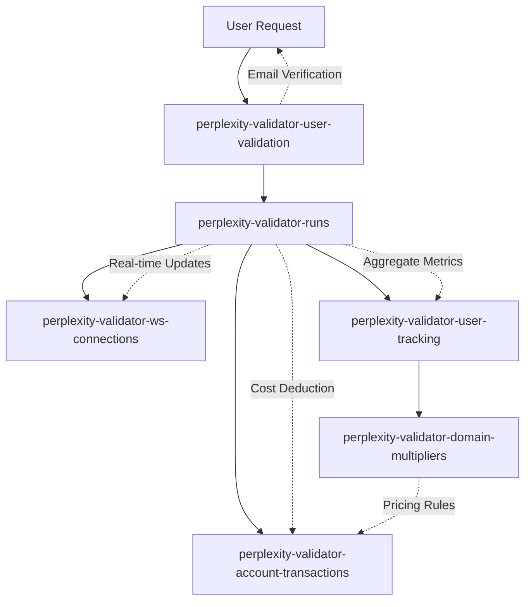

# DynamoDB Tables Documentation

This document describes the current DynamoDB table structure for the Perplexity Validator system.

## Table Overview

The system uses 8 DynamoDB tables to manage validation sessions, user data, financial transactions, and real-time connections:

### 📊 **Core Tables (Essential)**

| Table | Purpose | Items | Size | Status |
|-------|---------|-------|------|--------|
| `perplexity-validator-runs` | Modern session tracking & progress | 245 | 698KB | ✅ Active |
| `perplexity-validator-user-tracking` | User analytics & usage aggregation | 8 | 3.8KB | ✅ Active |
| `perplexity-validator-user-validation` | Email verification workflow | 4 | 993B | ✅ Active |
| `perplexity-validator-account-transactions` | Financial transaction history | 1 | 230B | ✅ Active |
| `perplexity-validator-domain-multipliers` | Domain-specific cost multipliers | 2 | ~300B | ✅ Active |
| `perplexity-validator-ws-connections` | WebSocket connection management | 0 | 0B | ✅ Active (ephemeral) |

### 🗑️ **Legacy Tables (Cleaned)**

| Table | Purpose | Items | Size | Status |
|-------|---------|-------|------|--------|
| `perplexity-validator-call-tracking` | Legacy session tracking | 0 | 0B | 🧹 Cleared |
| `perplexity-validator-token-usage` | Granular token usage tracking | 0 | 0B | 🧹 Empty/Unused |

## Detailed Table Schemas

### 1. `perplexity-validator-runs`

**Purpose:** Modern session tracking with real-time progress updates and rich validation data.

**Key Schema:**
- `session_id` (HASH) - Unique session identifier (format: `session_YYYYMMDD_HHMMSS_xxxxxxxx`)

**Key Fields:**
```json
{
  "session_id": "session_20250811_222303_bc5e4d25",
  "email": "user@domain.com",
  "status": "COMPLETED|IN_PROGRESS|ERROR",
  "start_time": "2025-08-11T22:23:27.561528+00:00",
  "end_time": "2025-08-11T22:23:30.746079+00:00",
  "percent_complete": 100.0,
  "processed_rows": 3.0,
  "total_rows": 114.0,
  "preview_data": {
    "cost_estimates": {
      "per_row_cost": 0.057859,
      "estimated_total_cost": 6.595926,
      "preview_cost": 0.17357700
    },
    "token_usage": {
      "total_tokens": 25695.0,
      "by_provider": {
        "perplexity": {
          "prompt_tokens": 17654.0,
          "completion_tokens": 8041.0,
          "total_cost": 0.17357700,
          "calls": 15.0
        },
        "anthropic": {
          "total_cost": 0.0,
          "calls": 0.0
        }
      }
    },
    "validation_metrics": {
      "search_groups_count": 5.0,
      "validated_columns_count": 23.0
    }
  }
}
```

**Cost Tracking Types:**
1. **`eliyahu_cost`**: What we actually paid (no cost for cached calls) - **PER CURRENT RUN**
2. **`estimated_cost`**: What current run would cost without caching - **PER CURRENT RUN**  
3. **`quoted_full_cost`**: Projected cost for full table validation = `(estimated_cost ÷ current_rows) × total_rows × multiplier` - **FULL TABLE QUOTE**
4. **`charged_cost`**: What we actually collected (`quoted_full_cost` for full validation, `0` for preview) - **ACTUAL CHARGE**

**Cost Scaling Logic:** Only `quoted_full_cost` involves scaling. For preview runs: `(preview_estimated_cost × multiplier ÷ preview_rows) × total_rows`.

**Business Logic:** Preview calculates and sends `quoted_full_cost` via websocket. Full validation charges exactly that `quoted_full_cost` from preview, ensuring users pay the promised amount regardless of actual full validation costs.

### 2. `perplexity-validator-user-tracking`

**Purpose:** Aggregate user analytics, lifetime usage statistics, and account balance.

**Key Schema:**
- `email` (HASH) - User email address

**Global Secondary Indexes:**
- `EmailDomainIndex`: `email_domain` (HASH) + `last_access` (RANGE)

**Key Fields:**
```json
{
  "email": "user@domain.com",
  "email_domain": "domain.com",
  "created_at": "2025-07-02T07:52:05.380000+00:00",
  "last_access": "2025-08-11T22:23:30.746079+00:00",
  
  // Request counts by type
  "total_preview_requests": 15.0,
  "total_full_requests": 8.0,
  "total_config_requests": 3.0,
  
  // Legacy token/cost fields (kept for compatibility)
  "total_tokens_used": 125000.0,
  "perplexity_tokens": 85000.0,
  "anthropic_tokens": 40000.0,
  "total_cost_usd": 42.50,
  "perplexity_cost": 28.75,
  "anthropic_cost": 13.75,
  
  // NEW: Enhanced validation metrics
  "total_rows_processed": 1250.0,
  "total_rows_analyzed": 5000.0,
  "total_columns_validated": 180.0,
  "total_search_groups": 45.0,
  "total_high_context_search_groups": 12.0,
  "total_claude_calls": 8.0,
  
  // NEW: Cost tracking with proper nomenclature
  "total_eliyahu_cost": 28.50,        // What we paid (actual costs)
  "total_estimated_cost": 45.75,      // What it would cost without caching (sum of all runs)
  "total_quoted_full_cost": 137.25,   // What we quoted users for full table validations
  "total_charged_cost": 98.50,        // What we collected from users
  "total_config_cost": 5.25,          // Config generation costs
  
  // NEW: Request-type specific metrics  
  "preview_rows_processed": 450.0,
  "preview_eliyahu_cost": 12.25,
  "preview_estimated_cost": 18.50,
  "full_rows_processed": 800.0,
  "full_charged_cost": 98.50,
  "config_generation_cost": 5.25,
  
  // NEW: Processing parameters tracking (per-run values)
  "batch_size": 25,                    // Batch size used for current/latest run
  "estimated_time": 2.5,               // Estimated processing time for current/latest run (hours)
  
  // NEW: API call tracking
  "total_api_calls_made": 125,         // Total number of API calls made across all runs
  "total_cached_calls_made": 45,       // Total number of cached API calls across all runs
  
  "account_balance": 51.0,
  "balance_last_updated": "2025-08-13T13:59:43.475937+00:00"
}
```

**Note:** Totals are aggregated across all user sessions, not per-session.

### 3. `perplexity-validator-user-validation`

**Purpose:** Email verification and authentication workflow.

**Key Schema:**
- `email` (HASH) - User email address

**Global Secondary Indexes:**
- `ValidationCodeIndex`: `validation_code` (HASH)

**Key Fields:**
```json
{
  "email": "user@domain.com",
  "validation_code": "ABC123",
  "created_at": "2025-08-09T20:16:29.156889+00:00",
  "expires_at": "2025-08-09T21:16:29.156889+00:00",
  "validated": true,
  "validated_at": "2025-08-09T20:17:17.514750+00:00",
  "attempts": 1,
  "ttl": 1728000000
}
```

**TTL:** Enabled on `ttl` field for automatic cleanup of expired codes.

### 4. `perplexity-validator-account-transactions`

**Purpose:** Financial audit trail for credit purchases, deductions, and balance changes.

**Key Schema:**
- `email` (HASH) - User email address
- `transaction_id` (RANGE) - Unique transaction UUID

**Global Secondary Indexes:**
- `SessionIndex`: Links transactions to validation sessions
- `TimestampIndex`: Time-based queries

**Key Fields:**
```json
{
  "email": "user@domain.com",
  "transaction_id": "2bd1156e-e3bd-41c3-9d8d-f33b965af92a",
  "timestamp": "2025-08-13T13:59:43.475937+00:00",
  "transaction_type": "admin_credit|session_deduction|purchase",
  "amount": 25.50,
  "balance_before": 25.50,
  "balance_after": 51.0,
  "description": "Manual credit added by admin via CLI",
  "session_id": "session_20250811_222303_bc5e4d25"
}
```

### 5. `perplexity-validator-domain-multipliers`

**Purpose:** Domain-specific cost multipliers for differential pricing.

**Key Schema:**
- `domain` (HASH) - Domain name or "global" for default

**Key Fields:**
```json
{
  "domain": "eliyahu.ai",
  "multiplier": 3.0,
  "created_at": "2025-08-13T14:00:57.570963+00:00",
  "created_by": "admin@cli",
  "notes": "Set via CLI on 2025-08-13T08:00:57.562505",
  "updated_at": "2025-08-13T14:00:57.570963+00:00"
}
```

**Special Domains:**
- `global`: Default multiplier (5.0x)
- `eliyahu.ai`: Custom multiplier (3.0x)

### 6. `perplexity-validator-ws-connections`

**Purpose:** WebSocket connection management for real-time progress updates.

**Key Schema:**
- `connection_id` (HASH) - WebSocket connection ID

**Key Fields:**
```json
{
  "connection_id": "abc123def456",
  "email": "user@domain.com",
  "session_id": "session_20250811_222303_bc5e4d25",
  "connected_at": "2025-08-11T22:23:27.561528+00:00",
  "ttl": 1728000000
}
```

**Note:** Connections are ephemeral and auto-expire via TTL.

## Data Flow & Relationships



## Tracking Metrics Summary

✅ **Email & Session Tracking**
- User email, session ID, timestamps
- Real-time progress updates

✅ **Activity Type Tracking**  
- Preview vs. full validation (via session ID patterns)
- Config generation workflows

✅ **Token Usage (By Provider)**
- Perplexity: prompt + completion tokens
- Anthropic: input + output + cache tokens
- API calls and cached calls count

✅ **Cost Tracking (3 Types)**
1. **Actual Cost**: Real cost paid (includes caching savings)
2. **Estimated Cost**: Cost without caching optimizations  
3. **Multiplied Cost**: Estimated cost × domain multiplier

✅ **Timing Metrics**
- Processing time per session/row
- Queue wait times, validation duration

✅ **Financial Audit Trail**
- Transaction history with before/after balances
- Credit purchases, session deductions
- Domain-specific multipliers

## Management Commands

Referenced in `src/manage_dynamodb_tables.py`:

```bash
# View table status
python manage_dynamodb_tables.py summary

# Export data (with backup)
python manage_dynamodb_tables.py export-all-csv

# Account management
python manage_dynamodb_tables.py check-balance user@domain.com
python manage_dynamodb_tables.py list-transactions user@domain.com
python manage_dynamodb_tables.py set-multiplier domain.com 2.5
```

## Architecture Evolution

**Before Cleanup:** Mixed legacy/modern tracking with data redundancy
**After Cleanup:** Clean separation of concerns:
- **Core Functionality**: runs, ws-connections  
- **Business Intelligence**: user-tracking, account-transactions, domain-multipliers
- **Authentication**: user-validation

This architecture supports comprehensive analytics while maintaining clean separation between operational data and business metrics.