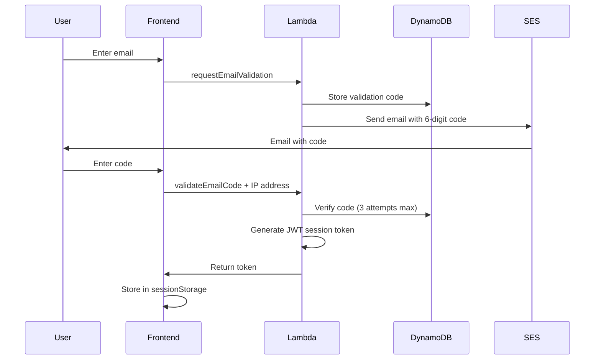

# Security Guide - Hyperplexity Validator

**Last Updated:** 2026-02-03
**Version:** 1.1
**Classification:** Internal Use

---

## Table of Contents

1. [Security Overview](#security-overview)
2. [Authentication & Authorization](#authentication--authorization)
3. [Data Protection](#data-protection)
4. [Rate Limiting & Abuse Prevention](#rate-limiting--abuse-prevention)
5. [Security Configuration](#security-configuration)
6. [Incident Response](#incident-response)
7. [Security Monitoring](#security-monitoring)
8. [Compliance & Best Practices](#compliance--best-practices)
9. [Security Checklist](#security-checklist)

---

## Security Overview

### Security Architecture

The Hyperplexity Validator implements **defense in depth** with multiple security layers:

```
┌─────────────────────────────────────────────────────────────┐
│ Layer 1: Frontend Security                                 │
│ - Session token storage (sessionStorage, not localStorage) │
│ - HTTPS-only cookies                                        │
│ - CSP headers                                               │
└─────────────────────────────────────────────────────────────┘
                           ↓
┌─────────────────────────────────────────────────────────────┐
│ Layer 2: API Gateway                                        │
│ - CORS restrictions (specific domains only)                 │
│ - Request size limits                                       │
│ - Throttling                                                │
└─────────────────────────────────────────────────────────────┘
                           ↓
┌─────────────────────────────────────────────────────────────┐
│ Layer 3: Lambda Authorization                               │
│ - JWT token verification (cryptographic signatures)         │
│ - Email validation checks                                   │
│ - Session ownership verification (cached)                   │
│ - Rate limiting (10 req/min per user)                       │
└─────────────────────────────────────────────────────────────┘
                           ↓
┌─────────────────────────────────────────────────────────────┐
│ Layer 4: Data Access                                        │
│ - S3 presigned URLs (5-minute expiration)                   │
│ - DynamoDB fine-grained access control                      │
│ - Encryption at rest (KMS)                                  │
└─────────────────────────────────────────────────────────────┘
                           ↓
┌─────────────────────────────────────────────────────────────┐
│ Layer 5: Monitoring & Logging                               │
│ - CloudWatch security event logging                         │
│ - X-Ray tracing                                             │
│ - Audit trails                                              │
└─────────────────────────────────────────────────────────────┘
```

### Threat Model

**Protected Assets:**
- User email addresses (PII)
- Validation results (business data)
- API keys and session tokens
- S3 file content

**Primary Threats:**
1. **Unauthorized Data Access** - Attackers accessing other users' validation results
2. **Email Spoofing** - Attackers claiming validated email addresses
3. **Brute Force Attacks** - Attempting to guess validation codes or enumerate sessions
4. **Data Exfiltration** - Downloading validation results without authorization
5. **Denial of Service** - Overwhelming the system with requests

**Mitigations Implemented:**
- ✅ JWT session tokens (prevents email spoofing)
- ✅ Backend authorization checks (prevents unauthorized access)
- ✅ Rate limiting (prevents brute force & DoS)
- ✅ IP-based lockouts (prevents distributed attacks)
- ✅ Session ownership verification (prevents data exfiltration)
- ✅ Security event logging (enables detection & response)
- ✅ Token revocation handling (automatic session cleanup on security violations)
- ✅ Universal ownership checks (all sessions including demos require ownership verification)

### Recent Security Improvements (v1.1 - 2026-02-03)

**Token Revocation Detection:**
- Backend now explicitly signals `token_revoked: true` when invalid/expired tokens are used
- Frontend automatically clears revoked tokens and prompts re-authentication
- Users see clear error messages instead of silent failures
- Prevents indefinite use of revoked session tokens

**Demo Session Security:**
- Fixed vulnerability where demo sessions (`session_demo_*`) bypassed ownership checks
- All demo sessions now undergo full ownership verification in DynamoDB
- Demo sessions create proper ownership records and must be enforced consistently
- Prevents unauthorized access to other users' preview/demo validation results

**Impact:**
- Closes potential attack vector where users could access others' demo sessions
- Improves user experience when tokens expire or are revoked
- Enforces defense-in-depth consistently across all session types

---

## Authentication & Authorization

### Email Validation Flow



### JWT Session Tokens

**Token Structure:**
```json
{
  "email": "user@example.com",
  "iat": 1738454400,
  "exp": 1738540800,
  "jti": "1738454400123"
}
```

**Security Features:**
- **Algorithm:** HMAC-SHA256 (symmetric signing)
- **Expiration:** 24 hours
- **Unique ID:** Millisecond timestamp prevents token reuse
- **Storage:** sessionStorage (cleared when browser closes)
- **Transmission:** `X-Session-Token` header

**Secret Key Management:**

1. **Production (REQUIRED):**
   ```bash
   # Store in AWS Parameter Store (encrypted with KMS)
   aws ssm put-parameter \
     --name "/perplexity-validator/jwt-secret-key" \
     --value "$(python3 -c 'import secrets; print(secrets.token_hex(32))')" \
     --type "SecureString" \
     --region us-east-1
   ```

2. **Development:**
   ```bash
   # Set as environment variable
   export JWT_SECRET_KEY="dev-only-secret-change-in-production"
   ```

3. **Rotation (Every 90 Days):**
   ```bash
   # Generate new secret
   NEW_SECRET=$(python3 -c 'import secrets; print(secrets.token_hex(32))')

   # Update Parameter Store
   aws ssm put-parameter \
     --name "/perplexity-validator/jwt-secret-key" \
     --value "$NEW_SECRET" \
     --overwrite \
     --region us-east-1

   # Restart Lambda to clear cache (or wait for cold start)
   aws lambda update-function-configuration \
     --function-name perplexity-validator-interface \
     --description "Rotated JWT secret $(date +%Y-%m-%d)" \
     --region us-east-1
   ```

### Session Ownership Verification

**Implementation:**
```python
# In viewer_data.py
def _verify_session_ownership_cached(email: str, session_id: str) -> bool:
    """
    Verify that email owns session_id with Lambda caching.

    Performance:
    - Cache hit: ~2ms (dictionary lookup)
    - Cache miss: ~30ms (DynamoDB read)
    - Cache TTL: 5 minutes
    - Expected hit rate: >95%
    """
    # Check Lambda instance cache first
    cache_key = f"{email}:{session_id}"
    if cache_key in _SESSION_OWNERSHIP_CACHE:
        return _SESSION_OWNERSHIP_CACHE[cache_key]['is_owner']

    # Query DynamoDB
    session = runs_table.get_item(Key={'session_id': session_id})
    is_owner = session['Item']['email'] == email

    # Cache result
    _SESSION_OWNERSHIP_CACHE[cache_key] = {
        'is_owner': is_owner,
        'timestamp': time.time()
    }

    return is_owner
```

**Security Guarantees:**
- ✅ Users can only access their own sessions (including demo/preview sessions)
- ✅ Email cannot be spoofed (verified via JWT)
- ✅ Session IDs validated for format (prevents path traversal)
- ✅ All violations logged to CloudWatch
- ✅ Demo sessions (`session_demo_*`) undergo same ownership checks as regular sessions
- ✅ Automatic token revocation on ownership violations

**Note:** As of v1.1 (2026-02-03), ALL session types require ownership verification. Previous versions incorrectly bypassed ownership checks for demo sessions.

---

## Data Protection

### Data Classification

| Data Type | Classification | Encryption at Rest | Encryption in Transit | Retention |
|-----------|---------------|-------------------|----------------------|-----------|
| Email addresses | PII | ✅ KMS | ✅ TLS 1.2+ | Until user deletion |
| Validation codes | Sensitive | ✅ KMS | ✅ TLS 1.2+ | 10 minutes (TTL) |
| Session tokens | Sensitive | ❌ Client-side | ✅ TLS 1.2+ | 24 hours |
| Validation results | Business | ✅ S3 SSE | ✅ TLS 1.2+ | 1 year (lifecycle) |
| API logs | Operational | ✅ CloudWatch | ✅ TLS 1.2+ | 3 days |

### Encryption

**At Rest:**
- **DynamoDB:** AWS-managed KMS encryption (automatic)
- **S3:** Server-Side Encryption (SSE-S3)
- **Parameter Store:** SecureString with KMS encryption

**In Transit:**
- **API Gateway:** TLS 1.2+ enforced
- **S3 Presigned URLs:** HTTPS only
- **SES Email:** TLS required for delivery

### Data Retention & Deletion

**Automatic Deletion:**
```python
# DynamoDB TTL Configuration
{
    'email': 'user@example.com',
    'validation_code': '123456',
    'ttl': 1738454400  # Expires in 10 minutes
}
```

**S3 Lifecycle Rules:**
```python
{
    'Rules': [
        {
            'Id': 'DeleteValidationResults',
            'Status': 'Enabled',
            'Prefix': 'results/',
            'Expiration': {'Days': 365}  # 1 year retention
        },
        {
            'Id': 'DeleteDownloads',
            'Status': 'Enabled',
            'Prefix': 'downloads/',
            'Expiration': {'Days': 7}  # 7 days retention
        }
    ]
}
```

**User Data Deletion:**
```bash
# Manually delete user data (GDPR compliance)
aws dynamodb delete-item \
  --table-name perplexity-validator-user-validation \
  --key '{"email": {"S": "user@example.com"}}'

aws s3 rm s3://hyperplexity-storage/results/user@example.com/ --recursive
```

---

## Rate Limiting & Abuse Prevention

### Rate Limiting Strategy

**Three Layers of Protection:**

1. **API Gateway Throttling** (Coarse)
   - 10,000 requests/second (burst)
   - 5,000 requests/second (steady state)

2. **Lambda Rate Limiting** (Medium)
   - 10 requests/minute per email
   - Applied to: `getViewerData`, `generateConfig`

3. **Email Validation Rate Limiting** (Fine)
   - 3 code verification attempts per email
   - 10 code verification attempts per IP per hour
   - 15-minute lockout after 3 failed attempts

### Progressive Delays

**Exponential Backoff on Failed Validation:**
```python
# 1st failed attempt: 2 seconds delay
# 2nd failed attempt: 4 seconds delay
# 3rd failed attempt: 8 seconds delay + 15-minute lockout

delay_seconds = min(2 ** attempts, 60)
time.sleep(delay_seconds)
```

**Security Math:**
- 6-digit code = 1,000,000 combinations
- 3 attempts per email request
- 10 attempts per IP per hour
- With delays: ~158 days to brute force
- Code expires in 10 minutes = only ~40 attempts possible

**Conclusion:** Brute force attacks are **computationally infeasible**.

### DDoS Protection

**AWS Shield Standard** (included):
- Network layer (Layer 3) protection
- Transport layer (Layer 4) protection
- Automatic detection and mitigation

**CloudFront (if enabled):**
- Geographic blocking
- Rate-based rules
- Custom WAF rules

**Lambda Concurrency Limits:**
- Reserved concurrency: 100 (prevents cost runaway)
- Throttling: Automatic backpressure

---

## Security Configuration

### CORS Configuration

**Current Settings:**
```python
# deployment/create_unified_s3_bucket.py
cors_config = {
    'CORSRules': [
        {
            'AllowedOrigins': [
                'https://eliyahu.ai',        # Production
                'https://www.eliyahu.ai',    # Production WWW
                'http://localhost:8000',     # Development (REMOVE IN PROD)
                'http://localhost:3000'      # Development (REMOVE IN PROD)
            ],
            'AllowedMethods': ['GET', 'HEAD'],
            'AllowedHeaders': ['Content-Type', 'Authorization', 'X-Session-Token'],
            'MaxAgeSeconds': 600
        }
    ]
}
```

**⚠️ PRODUCTION DEPLOYMENT CHECKLIST:**
- [ ] Remove `localhost` origins from CORS
- [ ] Verify production domain is correct
- [ ] Test CORS from production domain
- [ ] Monitor CORS errors in CloudWatch

### IAM Permissions

**Lambda Execution Role:**
```json
{
  "Version": "2012-10-17",
  "Statement": [
    {
      "Effect": "Allow",
      "Action": [
        "logs:CreateLogGroup",
        "logs:CreateLogStream",
        "logs:PutLogEvents"
      ],
      "Resource": "arn:aws:logs:*:*:*"
    },
    {
      "Effect": "Allow",
      "Action": [
        "s3:GetObject",
        "s3:PutObject"
      ],
      "Resource": "arn:aws:s3:::hyperplexity-storage/*"
    },
    {
      "Effect": "Allow",
      "Action": [
        "dynamodb:GetItem",
        "dynamodb:PutItem",
        "dynamodb:UpdateItem",
        "dynamodb:Query"
      ],
      "Resource": [
        "arn:aws:dynamodb:us-east-1:*:table/perplexity-validator-runs",
        "arn:aws:dynamodb:us-east-1:*:table/perplexity-validator-user-validation"
      ]
    },
    {
      "Effect": "Allow",
      "Action": [
        "ssm:GetParameter",
        "ssm:GetParameters"
      ],
      "Resource": "arn:aws:ssm:us-east-1:*:parameter/perplexity-validator/*"
    },
    {
      "Effect": "Allow",
      "Action": [
        "kms:Decrypt"
      ],
      "Resource": "arn:aws:kms:us-east-1:*:key/*"
    },
    {
      "Effect": "Allow",
      "Action": [
        "ses:SendEmail",
        "ses:SendRawEmail"
      ],
      "Resource": "*"
    }
  ]
}
```

**Principle of Least Privilege:**
- ✅ Read-only access to Parameter Store
- ✅ Scoped S3 access (bucket-specific)
- ✅ Scoped DynamoDB access (table-specific)
- ✅ No wildcard permissions (except SES - required by AWS)

### Content Security Policy (CSP)

**Recommended Headers:**
```http
Content-Security-Policy:
  default-src 'self';
  script-src 'self' 'unsafe-inline';
  style-src 'self' 'unsafe-inline';
  img-src 'self' data: https:;
  connect-src 'self' https://api.eliyahu.ai wss://xt6790qk9f.execute-api.us-east-1.amazonaws.com;
  font-src 'self';
  object-src 'none';
  frame-ancestors 'none';
  base-uri 'self';
  form-action 'self';
```

---

## Incident Response

### Security Incident Classification

| Severity | Description | Response Time | Escalation |
|----------|-------------|---------------|------------|
| **CRITICAL** | Data breach, unauthorized access | < 1 hour | Immediate |
| **HIGH** | Suspected intrusion, DoS attack | < 4 hours | Within 1 hour |
| **MEDIUM** | Repeated failed auth, suspicious activity | < 24 hours | Within 4 hours |
| **LOW** | Rate limit violations, misconfigurations | < 72 hours | As needed |

### Incident Response Playbook

**Phase 1: Detection (0-15 minutes)**

1. **Identify the incident:**
   - CloudWatch alarm triggered
   - Security event spike in logs
   - User report of unauthorized access

2. **Initial assessment:**
   ```bash
   # Check recent security events
   aws logs filter-log-events \
     --log-group-name /aws/lambda/perplexity-validator-interface \
     --filter-pattern "[SECURITY]" \
     --start-time $(date -d '1 hour ago' +%s)000
   ```

3. **Determine severity** using table above

**Phase 2: Containment (15-60 minutes)**

1. **For data breach:**
   ```bash
   # Rotate JWT secret immediately
   aws ssm put-parameter \
     --name "/perplexity-validator/jwt-secret-key" \
     --value "$(python3 -c 'import secrets; print(secrets.token_hex(32))')" \
     --overwrite

   # Force Lambda restart
   aws lambda update-function-configuration \
     --function-name perplexity-validator-interface \
     --description "Emergency JWT rotation $(date)"
   ```

2. **For DoS attack:**
   ```bash
   # Enable API Gateway throttling
   aws apigateway update-stage \
     --rest-api-id <api-id> \
     --stage-name prod \
     --patch-operations \
       op=replace,path=/throttle/rateLimit,value=100 \
       op=replace,path=/throttle/burstLimit,value=50
   ```

3. **For compromised user:**
   ```bash
   # Invalidate user session
   aws dynamodb delete-item \
     --table-name perplexity-validator-user-validation \
     --key '{"email": {"S": "compromised@example.com"}}'
   ```

**Phase 3: Investigation (1-4 hours)**

1. **Collect evidence:**
   ```bash
   # Export CloudWatch logs
   aws logs create-export-task \
     --log-group-name /aws/lambda/perplexity-validator-interface \
     --from $(date -d '24 hours ago' +%s)000 \
     --to $(date +%s)000 \
     --destination hyperplexity-security-logs \
     --destination-prefix incident-$(date +%Y%m%d)
   ```

2. **Analyze attack vectors:**
   - Review CloudWatch Insights queries
   - Check X-Ray traces for anomalies
   - Correlate IP addresses with known threat feeds

3. **Identify root cause:**
   - Configuration error?
   - Zero-day vulnerability?
   - Social engineering?
   - Insider threat?

**Phase 4: Eradication (4-24 hours)**

1. **Fix vulnerability:**
   - Apply security patches
   - Update configurations
   - Revoke compromised credentials

2. **Verify fix:**
   - Penetration testing
   - Security scanning
   - Code review

**Phase 5: Recovery (24-72 hours)**

1. **Restore normal operations:**
   - Gradually remove emergency restrictions
   - Monitor for recurrence
   - Communicate with affected users

2. **Post-incident review:**
   - Document timeline
   - Identify lessons learned
   - Update runbooks
   - Improve monitoring

**Phase 6: Post-Incident Activities**

1. **Update security controls:**
   - Implement additional mitigations
   - Update WAF rules
   - Enhance logging

2. **User notification (if required):**
   - GDPR compliance: 72-hour notification for data breaches
   - Template email to affected users
   - Transparency report (if applicable)

### Contact Information

**Security Team:**
- Email: security@eliyahu.ai
- Emergency: [Phone number]
- Slack: #security-incidents

**AWS Support:**
- Support Plan: Business/Enterprise
- TAM: [Name if applicable]
- Support Case: https://console.aws.amazon.com/support/

---

## Security Monitoring

### CloudWatch Metrics

**Security Metrics Dashboard:**
```bash
# Create security dashboard
aws cloudwatch put-dashboard \
  --dashboard-name HyperplexitySecurity \
  --dashboard-body file://docs/cloudwatch-dashboard.json
```

**Key Metrics:**
- `ownership_violation` - Users attempting to access others' data
- `rate_limit_exceeded` - Rate limit violations
- `invalid_session_format` - Malformed session IDs (path traversal attempts)
- `path_traversal_attempt` - Path traversal detection
- `unvalidated_email_access` - Unauthorized access attempts
- `account_locked` - Account lockouts due to failed validation

### CloudWatch Alarms

**Critical Alarms:**
```bash
# Alarm on ownership violations
aws cloudwatch put-metric-alarm \
  --alarm-name "Hyperplexity-OwnershipViolations-Critical" \
  --alarm-description "Alert on ownership violation attempts" \
  --metric-name ownership_violation \
  --namespace Hyperplexity/Security \
  --statistic Sum \
  --period 3600 \
  --evaluation-periods 1 \
  --threshold 5 \
  --comparison-operator GreaterThanThreshold \
  --alarm-actions arn:aws:sns:us-east-1:*:security-alerts

# Alarm on path traversal attempts
aws cloudwatch put-metric-alarm \
  --alarm-name "Hyperplexity-PathTraversal-Critical" \
  --alarm-description "Alert on path traversal attempts" \
  --metric-name path_traversal_attempt \
  --namespace Hyperplexity/Security \
  --statistic Sum \
  --period 3600 \
  --evaluation-periods 1 \
  --threshold 1 \
  --comparison-operator GreaterThanThreshold \
  --alarm-actions arn:aws:sns:us-east-1:*:security-alerts
```

### CloudWatch Insights Queries

**Top 10 Failed Authentication Attempts:**
```
fields @timestamp, email, ip_address
| filter event_type = "invalid_code" or event_type = "account_locked"
| stats count() as attempts by email, ip_address
| sort attempts desc
| limit 10
```

**Ownership Violation Timeline:**
```
fields @timestamp, email, session_id, ip_address
| filter event_type = "ownership_violation"
| sort @timestamp desc
| limit 100
```

**Rate Limit Analysis:**
```
fields @timestamp, email, action, limit
| filter event_type = "rate_limit_exceeded"
| stats count() as violations by email, action
| sort violations desc
```

### X-Ray Tracing

**Enable X-Ray:**
```python
# In Lambda config (already enabled)
'TracingConfig': {
    'Mode': 'Active'
}
```

**Analyze Security Events:**
- View traces for failed authorization
- Identify performance bottlenecks in auth checks
- Correlate security events across services

---

## Compliance & Best Practices

### GDPR Compliance

**Data Subject Rights:**

1. **Right to Access:**
   ```bash
   # Export user data
   aws dynamodb get-item \
     --table-name perplexity-validator-user-validation \
     --key '{"email": {"S": "user@example.com"}}'

   aws s3 ls s3://hyperplexity-storage/results/user@example.com/ --recursive
   ```

2. **Right to Deletion:**
   ```bash
   # Delete all user data
   ./scripts/delete-user-data.sh user@example.com
   ```

3. **Right to Data Portability:**
   ```bash
   # Export in machine-readable format (JSON)
   ./scripts/export-user-data.sh user@example.com > user-data.json
   ```

4. **Breach Notification:**
   - 72-hour notification requirement
   - Template email: `docs/templates/breach-notification.txt`
   - Incident log: `docs/incidents/YYYY-MM-DD-incident.md`

### OWASP Top 10 Mitigation

| Vulnerability | Risk Level | Mitigation |
|---------------|------------|------------|
| **A01: Broken Access Control** | MITIGATED | ✅ Session ownership verification<br>✅ JWT token validation |
| **A02: Cryptographic Failures** | MITIGATED | ✅ TLS 1.2+ enforced<br>✅ KMS encryption at rest |
| **A03: Injection** | MITIGATED | ✅ Parameterized queries<br>✅ Input validation |
| **A04: Insecure Design** | MITIGATED | ✅ Threat modeling<br>✅ Defense in depth |
| **A05: Security Misconfiguration** | MITIGATED | ✅ Least privilege IAM<br>✅ CORS restrictions |
| **A06: Vulnerable Components** | ONGOING | ⚠️ Dependency scanning (manual)<br>⚠️ Regular updates |
| **A07: Auth Failures** | MITIGATED | ✅ Rate limiting<br>✅ Progressive delays |
| **A08: Data Integrity Failures** | MITIGATED | ✅ JWT signatures<br>✅ Input validation |
| **A09: Logging Failures** | MITIGATED | ✅ Security event logger<br>✅ CloudWatch integration |
| **A10: SSRF** | MITIGATED | ✅ No user-controlled URLs<br>✅ Allowlist-based access |

### Security Best Practices

**Development:**
- [ ] Code review for all security changes
- [ ] Static analysis (linting, type checking)
- [ ] Dependency vulnerability scanning
- [ ] Secrets scanning (never commit secrets)

**Deployment:**
- [ ] Automated testing in staging environment
- [ ] Blue/green deployment for zero downtime
- [ ] Rollback plan tested quarterly
- [ ] Security configuration validated

**Operations:**
- [ ] Weekly security log review
- [ ] Monthly security metrics review
- [ ] Quarterly penetration testing
- [ ] Annual security audit

**Monitoring:**
- [ ] CloudWatch alarms enabled
- [ ] SNS notifications configured
- [ ] On-call rotation established
- [ ] Incident response playbook updated

---

## Security Checklist

### Pre-Deployment Checklist

**Secrets Management:**
- [ ] JWT secret generated with `secrets.token_hex(32)`
- [ ] JWT secret stored in Parameter Store (`/perplexity-validator/jwt-secret-key`)
- [ ] IAM permissions granted for Parameter Store access
- [ ] KMS key permissions configured for decryption
- [ ] Default secret (`CHANGE-THIS-IN-PRODUCTION`) removed from code

**CORS Configuration:**
- [ ] Production domain added to CORS allowed origins
- [ ] `localhost` origins removed from production CORS
- [ ] `null` origin removed (if added for testing)
- [ ] CORS tested from production domain
- [ ] Preflight requests working correctly

**Rate Limiting:**
- [ ] IP-based rate limiting enabled (10/hour for validation codes)
- [ ] API rate limiting enabled (10/min for viewer data)
- [ ] Progressive delays configured (exponential backoff)
- [ ] Account lockout enabled (15 minutes after 3 failures)
- [ ] Rate limit violations logged to CloudWatch

**Authorization:**
- [ ] JWT token verification enabled
- [ ] Session ownership verification enabled
- [ ] Session ID format validation enabled
- [ ] Email validation check enabled
- [ ] Ownership cache configured (5-minute TTL)

**Monitoring:**
- [ ] CloudWatch Logs configured (3-day retention)
- [ ] Security metrics published to CloudWatch
- [ ] Security dashboard created
- [ ] Critical alarms configured
- [ ] SNS notifications enabled
- [ ] X-Ray tracing enabled

**Data Protection:**
- [ ] S3 encryption enabled (SSE-S3)
- [ ] DynamoDB encryption enabled (AWS-managed KMS)
- [ ] TLS 1.2+ enforced for all endpoints
- [ ] Presigned URL expiration set to 5 minutes
- [ ] S3 lifecycle rules configured (1-year retention)

**IAM & Permissions:**
- [ ] Lambda execution role follows least privilege
- [ ] Parameter Store access scoped to `/perplexity-validator/*`
- [ ] S3 access scoped to `hyperplexity-storage` bucket
- [ ] DynamoDB access scoped to specific tables
- [ ] No wildcard permissions (except SES)

### Post-Deployment Checklist

**Verification:**
- [ ] JWT tokens issued successfully
- [ ] Session ownership verification working
- [ ] Rate limiting triggering correctly
- [ ] Security events logged to CloudWatch
- [ ] Alarms firing for test violations
- [ ] Presigned URLs accessible for authorized users
- [ ] Presigned URLs rejected for unauthorized users

**Testing:**
- [ ] Attempt email spoofing (should fail)
- [ ] Attempt session hijacking (should fail)
- [ ] Attempt brute force validation codes (should lock out)
- [ ] Attempt path traversal (should block)
- [ ] Attempt ownership violation (should log and deny)
- [ ] Verify CORS from unauthorized domain (should fail)

**Documentation:**
- [ ] Security documentation updated
- [ ] Deployment instructions current
- [ ] Incident response playbook reviewed
- [ ] Security contact information updated
- [ ] Compliance documentation complete

### Monthly Security Review

**Metrics Review:**
- [ ] Review security violation trends
- [ ] Analyze rate limit patterns
- [ ] Check for unusual login attempts
- [ ] Review failed authorization attempts
- [ ] Identify potential attack patterns

**Configuration Review:**
- [ ] Verify IAM permissions haven't drifted
- [ ] Check CORS configuration
- [ ] Review rate limit thresholds
- [ ] Validate encryption settings
- [ ] Audit user access patterns

**Log Analysis:**
- [ ] Review CloudWatch Logs for anomalies
- [ ] Check X-Ray traces for performance issues
- [ ] Analyze security event distribution
- [ ] Identify false positives in alarms
- [ ] Update alarm thresholds if needed

**Compliance Check:**
- [ ] GDPR data retention compliance
- [ ] PII handling procedures followed
- [ ] Breach notification readiness
- [ ] Audit trail completeness
- [ ] Security training completion

---

## Appendix

### Quick Reference

**Generate JWT Secret:**
```bash
python3 -c "import secrets; print(secrets.token_hex(32))"
```

**Store Secret in Parameter Store:**
```bash
aws ssm put-parameter \
  --name "/perplexity-validator/jwt-secret-key" \
  --value "YOUR_SECRET_HERE" \
  --type "SecureString" \
  --region us-east-1
```

**Check Security Events:**
```bash
aws logs tail /aws/lambda/perplexity-validator-interface \
  --follow \
  --filter-pattern "[SECURITY]"
```

**View CloudWatch Dashboard:**
```
https://console.aws.amazon.com/cloudwatch/home?region=us-east-1#dashboards:name=HyperplexitySecurity
```

### Security Contacts

**Internal:**
- Security Team: security@eliyahu.ai
- On-Call: [Phone/Pager]
- Slack: #security-incidents

**External:**
- AWS Support: https://console.aws.amazon.com/support/
- AWS Security: https://aws.amazon.com/security/vulnerability-reporting/
- Responsible Disclosure: security@eliyahu.ai

### Document History

| Version | Date | Author | Changes |
|---------|------|--------|---------|
| 1.1 | 2026-02-03 | Claude/Elliott | Fixed demo session security bypass, added token revocation handling |
| 1.0 | 2026-02-02 | Claude/Elliott | Initial security documentation |

---

**END OF SECURITY GUIDE**

For questions or concerns, contact: security@eliyahu.ai
